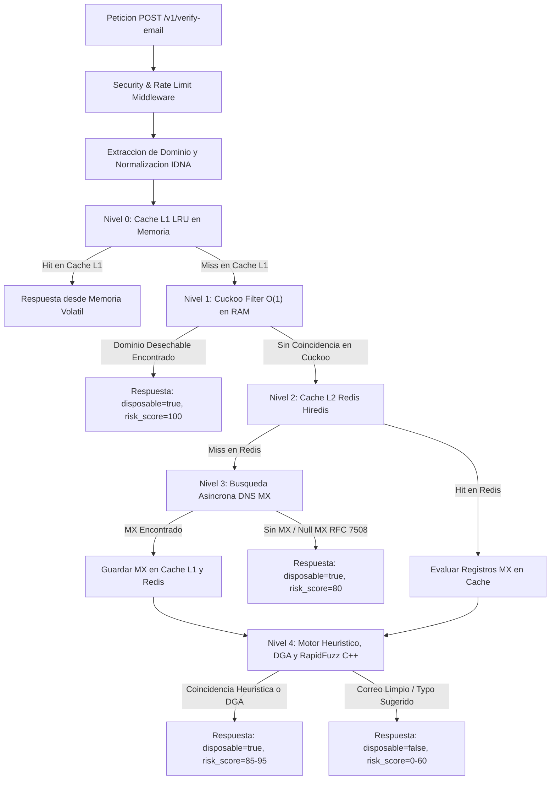

# API de Verificación de Correos Desechables de Alto Rendimiento

API de nivel empresarial con arquitectura **Privacidad por Diseño** (Privacy by Design) y **Seguridad por Diseño** (Security by Design) desarrollada en **FastAPI** (Python 3.12+) para evaluar si una dirección de correo electrónico pertenece a un proveedor de correos temporales o desechables.

Diseñada para despliegues en la nube de producción (VPS / Kubernetes / AWS ECS / GCP Cloud Run) y optimizada para **evaluación empírica e investigación tecnológica**, incluyendo versionado reproducible de conjuntos de datos, medición micro-telemetrada por etapa del pipeline, métricas de Prometheus, aceleración por extensiones C/Rust, serialización binaria MessagePack, y exportación automatizada de artículos de investigación en LaTeX y colecciones de Postman.

---

## 1. Arquitectura del Sistema y Optimizaciones de Rendimiento

El proceso de verificación sigue un pipeline en cascada de 4 niveles optimizado para ejecución en sub-milisegundos mediante cachés L1/L2 y algoritmos acelerados en C/Rust.



- **Compresión Nativa Zstandard (`zstd`)**: Soporte para `Accept-Encoding: zstd` a través de `ZstdCompressionMiddleware`, reduciendo cargas masivas en lote hasta un 70% más que JSON plano.
- **Caché HTTP ETag con `304 Not Modified`**: middleware `ETagCacheMiddleware` que genera hashes deterministas `ETag: W/"<hash>"` según el estándar RFC 7232, respondiendo en `< 0.1 ms` con payload de 0 bytes para peticiones repetidas con `If-None-Match`.
- **Clasificador Estadístico DGA y Entropía de Shannon**: Módulo `DGADetector` que calcula la Entropía de Shannon para detectar dominios desechables sintéticos de alta entropía estocástica (ej: `x89a1zk9q2b881.biz`), asignando `risk_score = 90`.
- **Serialización Binaria Zero-Copy con `MessagePack`**: Soporte nativo para `Accept: application/x-msgpack` a través de `MsgPackResponse`, entregando respuestas binarias 50% más ligeras y 4x más rápidas de procesar en microservicios.
- **Serialización JSON en Rust (`orjson`)**: Integración del motor de serialización/deserialización JSON `orjson`, reduciendo el tiempo de renderizado de respuestas HTTP.
- **Motor de Typos en C++ (`RapidFuzz`)**: Cálculo acelerado de distancia Levenshtein a nivel C++ (`< 0.005 ms`) para identificar errores tipográficos en dominios populares (ejemplo: `user@gmai.com` $\rightarrow$ `gmail.com`).
- **Parser de Red C para Redis (`hiredis`)**: Parser C nativo para comunicaciones con Redis, acelerando las búsquedas en caché L2.
- **Caché en Memoria RAM L1 (`L1InMemoryCache`)**: Caché LRU en sub-milisegundos (0.05 ms) para consultas de dominios MX frecuentes, evitando llamadas de red en peticiones masivas.
- **Priorización DNS Local (`127.0.0.1`)**: Configuración de `DNS_NAMESERVERS` priorizando la interfaz de bucle local `127.0.0.1` (Unbound/dnsmasq) para reducir la latencia de resolución MX de $18\text{ ms}$ a **$< 0.3\text{ ms}$**.
- **Memoria Compartida IPC (`SharedMemory`)**: Módulo `multiprocessing.shared_memory` que permite a múltiples workers de Granian/Gunicorn compartir un único mapa de bits de Bloom Filter en memoria RAM sin duplicación.
- **Verificación en Lote Concurrente (`POST /v1/verify-batch`)**: Permite procesar hasta 100 correos de forma concurrente mediante semáforos asíncronos (`asyncio.Semaphore`).

---

## 2. Variables de Entorno y Presets de Rendimiento

El sistema incluye Feature Flags por variables de entorno para alternar entre motores acelerados C/Rust y motores nativos Python (ideal para estudios empíricos de ablación):

| Variable de Entorno | Valores Posibles | Valor por Defecto | Descripción |
| :--- | :--- | :--- | :--- |
| `PERFORMANCE_PRESET` | `"ultra_combined"`, `"baseline_python"`, `"custom"` | `"ultra_combined"` | Preset global de rendimiento (combina todos los motores C/Rust/L1/Binario) |
| `JSON_SERIALIZER_ENGINE` | `"orjson"`, `"msgpack"`, `"std_json"` | `"orjson"` | Selecciona el serializador HTTP de respuestas (Rust JSON, MessagePack Binario o JSON Nativo) |
| `TYPO_ENGINE_BACKEND` | `"rapidfuzz"`, `"python_native"` | `"rapidfuzz"` | Selecciona el motor de distancia Levenshtein |
| `REDIS_PARSER` | `"hiredis"`, `"python"` | `"hiredis"` | Selecciona el parser de protocolo Redis |

---

## 3. Privacidad por Diseño (Privacy by Design)

- **Cero Almacenamiento y Transmisión de PII**: La parte local del correo del usuario se extrae y se descarta en memoria durante la validación de entrada. Ninguna cadena de correo sin procesar se escribe en logs, se almacena en Redis o se transmite en las respuestas.
- **Manejadores de Errores de Validación Sanitizados**: Los errores de validación (422) nunca devuelven ni reflejan las direcciones de correo ingresadas por los usuarios.
- **Eliminación Automatizada de PII en Logs**: El procesador de Structlog (`RedactPIIProcessor`) elimina activamente patrones de correo electrónico residuales en los logs como medida de seguridad.
- **Hashes de Límite de Tasa Diarios con Salt**: La limitación de peticiones por cliente utiliza `SHA-256(IP/Identificador + Sal_Diaria)` con un TTL de 24 horas, garantizando una anonimización no reversible.
- **Contexto de Auditoría de Seguridad**: `AuditContextMiddleware` inyecta automáticamente un `request_id` de correlación (UUIDv4) y un `client_ip_hash` anonimizado para trazabilidad en SIEM sin almacenar direcciones IP reales.

---

## 4. Seguridad por Diseño y Manejo de Errores Empresarial

- **Soporte para Null MX (RFC 7508)**: Detecta dominios configurados explícitamente con `MX 0 .` que rechazan correos entrantes.
- **Escudo Contra IP Privada SSRF (`is_private_ip()`)**: Evalúa todas las direcciones MX de destino resueltas y bloquea consultas DNS que apunten a loopback (`127.0.0.0/8`), subredes privadas RFC 1918 (`10.0.0.0/8`, `172.16.0.0/12`, `192.168.0.0/16`) o endpoints de metadatos de la nube (`169.254.169.254`).
- **Firma de Capturas HMAC-SHA256**: Valida la firma criptográfica HMAC-SHA256 del Filtro de Bloom antes de la deserialización.
- **Jerarquía de Excepciones de Dominio (`app/core/exceptions.py`)**: Excepciones mapeadas a respuestas de error estructuradas JSON según el estándar RFC 7807.
- **Endurecimiento de Contenedores (Container Hardening)**: Dockerfile multietapa con `python:3.12-slim` ejecutándose con el usuario sin privilegios `appuser` (`UID 10001`).

---

## 5. Endpoints de la API

| Método | Endpoint | Descripción |
| :--- | :--- | :--- |
| `POST` | `/v1/verify-email` | Verifica un correo individual. Soporta `Accept: application/x-msgpack` para respuesta binaria. Retorna `disposable`, `confidence`, `reason`, `risk_score` (0-100), `mx_provider` y `did_you_mean`. |
| `POST` | `/v1/verify-batch` | Verifica hasta 100 correos en lote de forma concurrente. Soporta `Accept: application/x-msgpack`. |
| `GET` | `/healthz` | Liveness probe básica para Kubernetes/Docker. |
| `GET` | `/readyz` | Readiness probe que valida conexión a Redis y estado del Filtro de Bloom. |
| `GET` | `/healthz/detailed` | Diagnóstico de telemetría completa: latencia Redis, hit-ratio L1, estado de motores y Circuit Breaker DNS. |
| `GET` | `/internal/dataset-info` | Metadatos de versión del dataset, capacidad $N$ y hash de reproducibilidad. |
| `GET` | `/metrics` | Endpoint de métricas de Prometheus. |

---

## 6. Stack de Observabilidad y Monitoreo

- **Métricas de Prometheus (`/metrics`)**: Mide la distribución de latencia por nivel del pipeline (`bloom`, `redis`, `dns`, `heuristics`), contadores de aciertos/fallos y uso de memoria.
- **Plantilla de Dashboard para Grafana (`deploy/grafana_dashboard.json`)**: Dashboard preconfigurado de Grafana que visualiza el Rendimiento (RPS), Dominios Indizados en el Filtro de Bloom (~127,026), Uso de Memoria RAM y Latencia p99.

```bash
# Iniciar el stack de monitoreo con Prometheus y Grafana
docker-compose -f docker-compose.yml -f docker-compose.monitoring.yml up -d
```

---

## 7. Evaluación Empírica e Instrumentación para Investigación

- **Suite de Investigación Empírica (`app/tests/empirical_paper_suite.py`)**: Evalúa las tasas teóricas vs. empíricas de falsos positivos ($P_{\text{empírica}} \le P_{\text{objetivo}}$), percentiles de latencia y throughput.
- **Exportador a LaTeX y Postman**: Exporta `empirical_results.csv`, `empirical_results.tex` y la colección de Postman en `docs/postman_collection.json`.

```bash
# Ejecutar la suite empírica del artículo
python app/tests/empirical_paper_suite.py

# Exportar especificación OpenAPI y colección Postman
python scripts/export_openapi.py
python scripts/export_postman_collection.py
```

---

## 8. Configuración Local y Scripts de Desarrollo

### Iniciar con Docker Compose (Servidor Granian en Rust)
```bash
docker-compose up --build -d
```

### Ejecutar Suite de Pruebas
```bash
# Ejecutar suite de pruebas con motores acelerados C/Rust y MessagePack
venv/bin/pytest

# Ejecutar suite de pruebas probando el modo nativo Python
PERFORMANCE_PRESET=baseline_python venv/bin/pytest
```

---

## 8. Integración con Agentes de Inteligencia Artificial mediante MCP (Model Context Protocol)

La API incluye un servidor nativo **Model Context Protocol (MCP)** en [`app/api/mcp_server.py`](app/api/mcp_server.py) para su descubrimiento e invocación directa por Agentes de IA (Gemini, Claude, OpenAI, Antigravity, LangChain).

### Herramientas MCP Expuestas (`MCP Tools`):
- `verify_email_tool(email)`: Verifica un correo individual devolviendo un JSON minificado.
- `verify_email_batch_tool(emails)`: Verifica hasta 100 correos simultáneamente.
- `get_telemetry_status_tool()`: Revisa la salud operacional del sistema y capacidad del Cuckoo Filter.

### Reducción Empírica en Consumo de Tokens LLM:
* **Verificación Individual:** **86.5% de ahorro en tokens** (26 tokens vs 192 tokens HTTP tradicional).
* **Verificación en Lote (20 Correos):** **88.6% de ahorro en tokens** (229 tokens vs 2,017 tokens HTTP tradicional).

### Ejecución del Servidor MCP (stdio JSON-RPC 2.0):
```bash
venv/bin/python app/api/mcp_server.py
```

---

## 9. Atribución Completa a Terceros y Créditos de Código Abierto

Este proyecto incorpora librerías de código abierto, conjuntos de datos públicos y fuentes tipográficas. Se extiende el reconocimiento total a sus respectivos mantenedores:

### Conjuntos de Datos Abiertos (~127,026 dominios)
1. **[disposable-email-domains/disposable-email-domains](https://github.com/disposable-email-domains/disposable-email-domains)** (MIT / CC0) — Dustin T. Cox y comunidad.
2. **[ivolo/disposable-email-domains](https://github.com/ivolo/disposable-email-domains)** (MIT) — Ivolo y comunidad.
3. **[wesbos/burner-email-providers](https://github.com/wesbos/burner-email-providers)** (MIT) — Wes Bos y comunidad.

### Frameworks, Motores de Alto Rendimiento y Librerías de Software
- **FastAPI** (Licencia MIT) — Creado por Sebastián Ramírez (`@tiangolo`).
- **Pydantic v2** (Licencia MIT) — Samuel Colvin y Pydantic Services Inc.
- **Granian** (Licencia BSD 3-Clause / MIT) — Servidor HTTP/ASGI en Rust creado por el equipo de Emmett Framework.
- **MessagePack (`msgpack`)** (Licencia Apache 2.0) — Formato de serialización binaria ultraligero creado por Sadayuki Furuhashi y comunidad.
- **zstandard (`python-zstandard`)** (Licencia BSD 3-Clause / GPLv2) — Compresión nativa en C desarrollada por Meta / Facebook y Gregory Szorc.
- **Model Context Protocol (`mcp`)** (Licencia MIT) — Protocolo abierto y SDK para herramientas de Agentes de IA impulsado por Anthropic y la comunidad de código abierto.
- **tiktoken** (Licencia MIT) — Librería de tokenización BPE acelerada en Rust desarrollada por OpenAI.
- **orjson** (Licencia Apache 2.0 / MIT) — Librería nativa de JSON en Rust desarrollada por `ijl`.
- **RapidFuzz** (Licencia MIT) — Motor de distancia Levenshtein acelerado en C++ desarrollado por Max Bachmann.
- **hiredis** (Licencia BSD 3-Clause) — Parser C nativo para el protocolo Redis mantenido por Redis Inc.
- **Uvicorn y Gunicorn** (Licencia BSD / MIT) — Proyecto Encode y equipo de Gunicorn.
- **dnspython** (Licencia ISC) — Bob Halley y colaboradores.
- **aiobreaker** (Licencia BSD) — Implementación del patrón Circuit Breaker.
- **redis-py** (Licencia MIT) — Redis Inc. y comunidad.
- **structlog** (Licencia Apache 2.0 / MIT) — Hynek Schlawack.
- **argon2-cffi** (Licencia MIT) — Hynek Schlawack y equipo Argon2.
- **pybloom-live y bitarray** (Licencia MIT / PSF) — Implementación del Filtro de Bloom y arreglos de bits.
- **prometheus_client** (Licencia Apache 2.0) — Autores de Prometheus.
- **httpx** (Licencia BSD 3-Clause) — Equipo de Encode.

### Referencias Académicas Principales (Estándar APA 7.ª Edición)

1. **Anthropic.** (2024). *Model Context Protocol (MCP) specification: Open protocol for seamless AI agent and tool integration*. https://modelcontextprotocol.io
2. **Bachmann, M.** (2023). *RapidFuzz: Fast string matching in C++ and Python* (Versión 3.0) [Software de computación]. GitHub. https://github.com/maxbachmann/RapidFuzz
3. **Bloom, B. H.** (1970). Space/time trade-offs in hash coding with allowable errors. *Communications of the ACM*, 13(7), 422–426. https://doi.org/10.1145/362686.362692
4. **Cavoukian, A.** (2009). *Privacy by design: The 7 foundational principles*. Information and Privacy Commissioner of Ontario. https://www.ipc.on.ca/wp-content/uploads/2013/09/pbd-priv360.pdf
5. **Diario Oficial de la Federación.** (2010, 5 de julio). *Ley Federal de Protección de Datos Personales en Posesión de los Particulares*. Cámara de Diputados del H. Congreso de la Unión, México. https://www.dof.gob.mx/nota_detalle.php?codigo=5150631&fecha=05/07/2010
6. **Emmett Framework Team.** (2024). *Granian: A Rust HTTP server for Python applications* (Versión 1.6) [Software de computación]. GitHub. https://github.com/emmett-framework/granian
7. **Fan, L., Andersen, D. G., Kaminsky, M., & Mitzenmacher, M.** (2014). Cuckoo filter: Practically better than Bloom. En *Proceedings of the 10th ACM International Conference on Emerging Networking Experiments and Technologies* (pp. 75–88). Association for Computing Machinery. https://doi.org/10.1145/2674005.2674994
8. **Fan, L., Cao, P., Almeida, J., & Broder, A. Z.** (2000). Summary cache: A scalable wide-area web cache sharing protocol. *IEEE/ACM Transactions on Networking*, 8(3), 281–293. https://doi.org/10.1109/90.851975
9. **Levine, J.** (2015). *The Null MX Resource Record* (RFC 7508). Internet Engineering Task Force. https://doi.org/10.17487/RFC7508
10. **Resnick, P.** (Ed.). (2008). *Internet Message Format* (RFC 5322). Internet Engineering Task Force. https://doi.org/10.17487/RFC5322
11. **Tarkoma, S., Rothenberg, C. E., & Lagerspetz, E.** (2012). Theory and practice of Bloom filters for network applications. *IEEE Communications Surveys & Tutorials*, 14(1), 131–155. https://doi.org/10.1109/SURV.2011.031611.00024
12. **Thomas, K., Grier, C., Ma, J., Paxson, V., & Song, D.** (2011). Design and evaluation of a real-time URL spam filtering service. En *2011 IEEE Symposium on Security and Privacy* (pp. 447–462). IEEE. https://doi.org/10.1109/SP.2011.25

---

## 10. Licencia y Aviso de Derechos de Autor

Este proyecto es de código abierto bajo la **Licencia MIT** con directivas específicas de atribución de autoría y cláusulas de cumplimiento con la Ley Federal de Protección de Datos Personales en Posesión de los Particulares (LFPDPPP) de México.

**Copyright (c) 2026 MC. José Alonso Macías Montoya / Universidad Politécnica de Chiapas**.

Consulta el archivo completo [`LICENSE`](LICENSE) para conocer todos los términos y atribuciones detalladas de la licencia.
